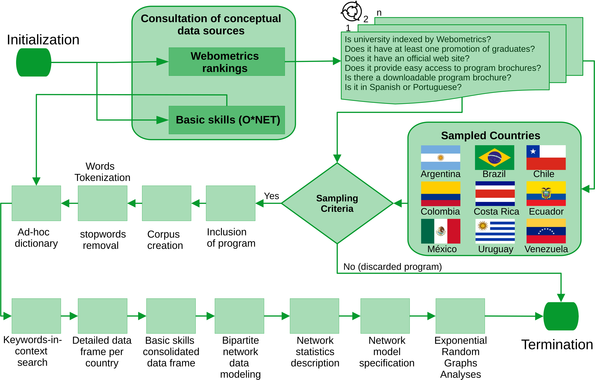

```{r, echo = FALSE, warning = FALSE}
# Packages
suppressPackageStartupMessages(library(tidyverse)) # Data wrangling
suppressPackageStartupMessages(library(ggplot2)) # Data visualization
suppressPackageStartupMessages(library(dplyr)) # Data wrangling
suppressPackageStartupMessages(library(gridExtra)) # arrange plots of ggplot 
suppressPackageStartupMessages(library(igraph)) # for modeling data as network
suppressPackageStartupMessages(library(network)) # for modeling and analyzing data as network
suppressPackageStartupMessages(library(ergm)) # for network-based statistical inference
suppressPackageStartupMessages(library(ergm.multi)) # for multivariate network-based statistical inference
suppressPackageStartupMessages(library(kableExtra)) # tables
suppressPackageStartupMessages(library(ggmosaic)) # tables
suppressPackageStartupMessages(library(knitr))
suppressPackageStartupMessages(library(broom)) # Convert Statistical 
suppressPackageStartupMessages(library(purrr)) # for mapping functions and vectors
suppressPackageStartupMessages(library(tibble)) # for tibbles
suppressPackageStartupMessages(library(psych)) # for multivariate analysis
```

# Motivation

Empirical research in higher education seldom adheres to FAIR principles and open science standards. The absence of these principles (i.e., Findable, Accessible, Interoperable, and Reusable) represents a significant barrier that prevents researchers from making meaningful contributions. Given the massive adoption of the so-called Large Language Models such as ChatGPT or Microsoft Copilot by university students and professors, it is timely to revisit teaching and learning practices, and understand the importance of basic skills such as reading comprehension, writing, or critical thinking. Here, we provide a supplementary material that follows the FAIR principles to promote open science standards among educational researchers.

# The Data

Our work presents a cross-national case study that estimates the importance of basic skills across 3,155 graduate programs offered by 481 universities at three educational levels or for three target audiences—specialization, master's, and doctoral programs—in nine Latin American countries. A visual representation of our workflow is depicted as follows.

 

The codes developed to preprocess the raw data are available in the following [GitHub repository](https://github.com/jcorrean/BasicSkillsLatam). Researchers interested in replicate or reproduce our analysis can find the RProject file `BasicSkillsLatam.RProj.`

The supplementary material is documented as a Quarto document with the name `SupplementaryMaterial.qmd` and can be rendered in RStudio.

## Raw data and pre-processing

Raw data are available as texts (PDF or docx files) in the folder of the corresponding sampled country. For example, sampled documents from Argentina are available in the folder "Argentina," documents from Brazil are available in the folder "Brazil," and so on. Texts pre-processing were handled with `readtext` and `quanteda` in a series of R scripts. These scripts are available in the folder "Pre-processing."

## Curated Data

As a convenient step in our analyses, we created the folder "Curated_Data" which provides curated data for each country. This curated data provides the estimated centrality for each basic skill in each country. Apart from these data, we also provide the NetworkData folder. This second folder contains the academic offering of each nation as a network data serialized in RDS format.

# Network analyses

Pre-processing texts result in a series of features-document matrices which are available in the folder "Matrices." We used these matrices as raw input for modeling the academic offering as a series of non-directed bipartite networks with the help of the `igraph` package.

## Network properties set up

The network properties of each nation's academic offering was done with the `network` package. The following network attributes are present for each academic offering: country of origin, membership to the Organization for Economic Development (OECD), network size, network density, network clustering (estimated by the `reinforcement_tm` algortihm available in the `tnet` package). Vertex attributes include the country of origin (for both node partitions), the length of the brochure (for nodes in the first partition), the degree centrality (for both node partitions), the eigenvector centrality (for both node partitions), the program level (for the first node partition), and the name of each skills (for nodes in the second partition). These vertex attributes enable us to exert statistical control when estimating the network effects in our series of exponential random graph models.

# Regional Network Analysis

The following table summarizes the network statistics of the academic offering of graduate programs in Latin American sampled countries. In general terms, the academic offering is weakly connected to basic skills (network density ranges from 0.005 in Brazil and Ecuador to 0.061 in Costa Rica). The weak connectivity between programs and basic skills reveals that the academic offering from sampled universities in Latin America highlights other contents that have nothing to do with basic skills as developed capacities that facilitate learning and a faster acquisition of knowledge.

```{r, echo = FALSE}
RegionalNetworks <- readRDS("NetworkData/RegionalNetworks.RDS")
RegionalNetworks %>%
  imap(~ {
    mnext_value <- .x$gal$mnext
    list(
      Country = .y,
      OECD.Member = .x %n% "OECD",
      n = network.size(.x),
      d = network.density(.x),
      Clustering = get.network.attribute(.x, "Clustering"),
      mnext = ifelse(is.null(mnext_value), NA_integer_, mnext_value)
    )
  }) %>%
  bind_rows() %>%
  group_by(Country) %>%
  summarize(
    OECD.Member = first(OECD.Member),
    Edges = mnext,
    Size = sum(n),
    Density = mean(d),
    Clustering = first(Clustering)
  ) %>%
  kable()
```

Despite the weak connectivity between programs and skills and to address the artifact discussed in section 3.5 of the article, we compare programs' and skills' centrality as a function of program levels in each country (see Figure F1).

```{r F1, fig.cap="Figure 1. Statistical distributions for the estimated importance of skills and programs.", echo=FALSE, fig.width=30, fig.height=18, warning=FALSE}
load("Results/Argentina.RData")
load("Results/Brazil.RData")
load("Results/Chile.RData")
load("Results/Colombia.RData")
load("Results/CostaRica.RData")
load("Results/Ecuador.RData")
load("Results/Mexico.RData")
load("Results/Uruguay.RData")
load("Results/Venezuela.RData")

rm(list=setdiff(ls(), c("ProgramsARG1", "ProgramsARG2", "ProgramsARG3",
                        "ProgramsBRA1", "ProgramsBRA2", "ProgramsBRA3",
                        "ProgramsCHL1", "ProgramsCHL2", "ProgramsCHL3",
                        "ProgramsCOL1", "ProgramsCOL2", "ProgramsCOL3",
                        "ProgramsCORI1", "ProgramsCORI2", "ProgramsCORI3",
                        "ProgramsECU1", "ProgramsECU2", "ProgramsECU3",
                        "ProgramsMEX1", "ProgramsMEX2", "ProgramsMEX3",
                        "ProgramsURU1", "ProgramsURU2", "ProgramsURU3",
                        "ProgramsVEN1", "ProgramsVEN2", "ProgramsVEN3")))

AllPrograms <- do.call(rbind, list(ProgramsARG1,
                                   ProgramsARG2,
                                   ProgramsARG3,
                                   ProgramsBRA1,
                                   ProgramsBRA2,
                                   ProgramsBRA3,
                                   ProgramsCHL1,
                                   ProgramsCHL2,
                                   ProgramsCHL3,
                                   ProgramsCOL1,
                                   ProgramsCOL2,
                                   ProgramsCOL3,
                                   ProgramsCORI1,
                                   ProgramsCORI2,
                                   ProgramsCORI3,
                                   ProgramsECU1,
                                   ProgramsECU2,
                                   ProgramsECU3,
                                   ProgramsMEX1,
                                   ProgramsMEX2,
                                   ProgramsMEX3,
                                   ProgramsURU1,
                                   ProgramsURU2,
                                   ProgramsURU3,
                                   ProgramsVEN1,
                                   ProgramsVEN2,
                                   ProgramsVEN3))


ggplot(AllPrograms, aes(x=Level, y=Eigenvector, fill = Partition)) +
  geom_violin() +
  scale_x_discrete(limits = c("Specialization", "Master", "PhD")) +
  facet_wrap(~Country) +
  theme_bw() +
  theme(legend.position = "bottom",
        legend.title=element_text(size=50), 
        legend.text=element_text(size=50),
        axis.title.x = element_text(size = 30, colour = "black"),
        axis.title.y = element_text(size = 30, colour = "black"),
        axis.text.x = element_text(size = 30, colour = "black"),
        axis.text.y = element_text(size = 30, colour = "black"),
        strip.text = element_text(face="bold", size=rel(3.5), colour = "black"),
        strip.background = element_rect(fill="grey", colour="grey",
                                        size=30)) +
  xlab("") + ylab("Normalized centrality degree") +
  labs(fill="")+
  scale_fill_manual(values = c("Skill" = "#09419e", "Program" = "red2"))
```


The next figure shows the normalized centrality for basic skills across programs (specialization, master, and PhD) and country. Scientific reasoning (science) emerged as the top basic skill with the highest centrality, regardless of the local academic offerings available in each country. Alongside scientific reasoning (science), the following basic skills complete the top five competencies: speaking, active listening, learning strategy, and active learning. We use this skill set as the basis for our network-based inferential analyses in the next section.


```{r F2, fig.cap="Figure 2. Normalized centrality for basic skills across programs and contries.", echo=FALSE, fig.width=40, fig.height=18, warning=FALSE}

Skills <- AllPrograms %>% filter(., Partition == "Skill")
Skills$Node <- gsub("^(ARG|BRA|CHL|COL|CR|ECU|MEX|URU|VEN)_", "", Skills$Node)
Skills$Level <- factor(Skills$Level, levels = c("Specialization", "Master", "PhD"))

ggplot(Skills, aes(x=reorder(Node, -Eigenvector), y=Eigenvector, fill = Level)) +
  geom_bar(position = "stack", stat = "identity") +
  scale_fill_manual(
    "",
    values = c("Specialization" = "royalblue4", "Master" = "lightsteelblue3", "PhD" = "lightskyblue2"),
    breaks = c("Specialization", "Master", "PhD") # <--- Add the breaks argument here
  ) +
  #  scale_fill_manual(values = c("steelblue1", "slateblue1", "slateblue4")) +
  facet_wrap(. ~ Country) +
  theme_linedraw() +
  coord_flip() +
  theme(axis.text.x = element_text(angle=0, hjust=1, size =40),
        axis.text.y = element_text(size = 40),
        axis.title.x = element_text(size = 30, colour = "black"),
        axis.title.y = element_text(size = 50, colour = "black"),
        legend.text = element_text(size = 30),
        legend.title = element_text(size = 20),
        legend.position = c(0.93, 0.93),
        strip.text = element_text(face="bold", size=rel(3.5), colour = "black"),
        strip.background = element_rect(fill="grey", colour="grey",
                                        size=30,))+
  xlab("") + ylab("Normalized centrality degree of basic skills") +
  labs(fill="")
```

# Inferential Network Analysis

To estimate the importance of these basic skills for the academic offering of graduate programs in Latin America, we now switch the attention to a series of exponential random graph models.

## Hypotheses and Model Specifications

### **Model 1** 

In this first model we examine the propensity of connections between programs and basic skills compared with the exogeneous covariable of brochure length. Given the weak connectivity described in our results section, we expect to find a negative and statistically significant effect for the term of network density. Here, the negative sign indicates that the connection are systematic far below any random chance. This is our baseline model that allows us to compare other effects in related ERGM models. In this first model, we also examine the effect of other hidden factors that might be confounded with the length of program brochures. Given the weak connectivity observed for the connection between program brochures and basic skills, we are inclined to think that the length of program brochures (captured by the number of sentences) might include other factors that are not explicitly related to basic skills but exert a positive and statistically significant effect on the observed network ties.


```{r, echo=FALSE, warning=FALSE, message=FALSE}
library(network)
RegionalNetworks <- readRDS("NetworkData/RegionalNetworks.RDS")
library(ergm)
library(ergm.multi)
library(coda)
SampledNetworks <- Networks(RegionalNetworks)

model1 <- ergm(SampledNetworks ~ edges + b1cov("Brochure.Length"), 
               control = control.ergm(MCMC.samplesize = 100000, 
                                      MCMC.burnin = 10000, 
                                      MCMLE.maxit = 10))
summary(model1)
```

The results of our first model confirm our two expectations. The sign for the edges term was negative and significant, confirming that the connectivity between university programs and basic skills is far below any random chance.  We also confirm that brochure's length exerts a positive and statistically significant effect on network ties, confirming that other aspects not explicitly related to basic skills are associated to the connectivity of our biparte network.

### **Model 2** 
Our second model is the next logical extension of our first model. In this second model we add the top five most central basic skills as endogenous network terms. We expect that these terms will be positive, greater than zero, and statistically significant. We also expect that the effect that each basic skill have on network ties will be greater than the effect of program brochures.

```{r, echo=FALSE, warning=FALSE, message=FALSE}
model2 <- ergm(SampledNetworks ~ edges + 
       b2factor("vertex.names", levels = c(8, 9, 2, 4, 1)) +
       b1factor('Program', levels = c("Doctorado", "Maestría")))
summary(model2)
```

The results from model 2 confirm our expectations, and most importantly, the ERGM estimates of basic skills remain intact compared to the estimates of model 1, suggesting that basic skills are robust enough without losing statistical power. 

### **Model 3**: 

This third model extend the scope of previous two models. Now, the model considers the effects of exogenous covariables of master's and doctoral programs, along with the exogenous factor of brochure length, and basic skills as endogenous factors of the bipartite network. We expect that the statistical estimates for our five basic skills will remain positive, greater than zero, and statistically significant, while the statistical estimate for the brochure length will remain non-significant and close to zero. 

```{r, echo=FALSE, warning=FALSE, message=FALSE}
model3 <- ergm(SampledNetworks ~ edges + 
                 b2factor("vertex.names", levels = c(8, 9, 2, 4, 1)) +
                 b1cov("Brochure.Length"))
summary(model3) # AIC: 36919
```

The results from model 3 do not confirm our expectations. Brochure length proved to exert a positive

### **Model 4**: 

Here we want to test wether the membershipt to OECD exert a significant effect on network ties. We expect that this factor is positive and statistically significant.

```{r, echo=FALSE, warning=FALSE, message=FALSE}
model4 <- ergm(SampledNetworks ~ edges + 
                 b2factor("vertex.names", levels = c(8, 9, 2, 4, 1)) +
                 b1factor('OECD', levels = "TRUE"))
summary(model4) # AIC: 36919
```
